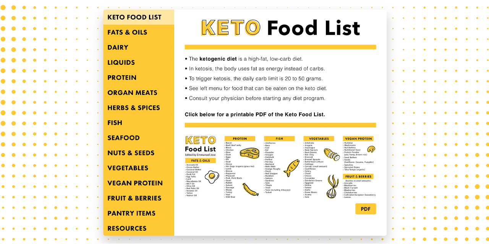

<p id="header"><p>

<table><tr>
<td> <a href="https://github.com/emjose/inspectext/#header"></a> </td>
<td> <a href="https://github.com/emjose/one-hundred/#header"></a> </td>
<td> <a href="https://github.com/emjose/keto-food-list/#header"></a> </td>

</tr></table>

<br>

<p id="project-title"><p>

<a href=#table-of-contents></a>

<br>

<a href="https://keto-food-list.vercel.app/"></a>

#

<p id="table-of-contents"><p>

<a href=#table-of-contents></a>

-   [100 Days of Code](#100days)
-   [Installation](#installation)
-   [Live Site](#live-site)
-   [Resources](#resources)
-   [Copyright](#copyright)
-   [Let's Connect!](#lets-connect)

#

<p id="100days"><p>

<a href=#100days></a>

### Day 36: April 2, 2022

-   The ketogenic diet is a high-fat, low-carb diet.

-   The **[Keto Food List](https://keto-food-list.vercel.app/)** is an online reference of keto-friendly food.

-   The visual style is directly based on Popsugar's [Keto Food List Guide](https://www.popsugar.com/fitness/Keto-Food-List-44531162), with structure adapted from a [vertical tabs tutorial](https://www.youtube.com/watch?v=oMP8u1LGUyU).

-   Categories were expanded, [Freepik](https://www.freepik.com/home) images were used, and a printable PDF was created in Photoshop.

-   Keyboard navigation and responsiveness to landscape orientation were also implemented.

-   **Consult your physician before starting a diet or fitness program**.

#

<p id="installation"><p>

<a href=#installation></a>

#### Git clone and cd into the repo folder:

```
git clone git@github.com:emjose/keto-food-list.git && cd keto-food-list
```

#### Run the command:

```
open index.html
```

#

<p id="live-site"><p>

<a href="https://keto-food-list.vercel.app/"></a>

<a href="https://keto-food-list.vercel.app/"></a>

• The **[Keto Food List](https://keto-food-list.vercel.app/)** is responsive and keyboard-navigable.

• Users can view lists of keto-friendly food, sorted by category.

#

<br>

<a href="https://keto-food-list.vercel.app/"></a>

• Users can view or download a **[printable PDF](https://keto-food-list.vercel.app/Documents/Keto-Food-List.pdf)** of the **[Keto Food List](https://keto-food-list.vercel.app/)**.

• The PDF can fit within 8.5 x 11 inches standard letter paper size (landscape orientation).

#

<p id="resources"><p>

<a href=#resources></a>

-   #### [Freepik](https://www.freepik.com/home)
-   #### [SmolCSS](https://smolcss.dev/)
-   #### [Cloudinary](https://cloudinary.com/)
-   #### [Adobe Fonts](https://fonts.adobe.com/)
-   #### [Adobe Photoshop](https://www.adobe.com/creativecloud/buy/students.html)
-   #### [Vertical Tabs Tutorial](https://www.youtube.com/watch?v=oMP8u1LGUyU)
-   #### [Array.prototype.forEach()](https://developer.mozilla.org/en-US/docs/Web/JavaScript/Reference/Global_Objects/Array/forEach)
-   #### [Ketogenic Diet 101 - Healthline](https://www.healthline.com/nutrition/ketogenic-diet-101)
-   #### [Orientation: CSS Media Feature](https://developer.mozilla.org/en-US/docs/Web/CSS/@media/orientation)
-   #### [Keto Food List Guide - Popsugar](https://www.popsugar.com/fitness/Keto-Food-List-44531162)
-   #### [Keto Diet Food List - Perfect Keto](https://perfectketo.com/full-ketogenic-diet-food-list/)
-   #### [Ketogenic Diet Food List - Dr. Berg](https://www.youtube.com/watch?v=bzs_60vTkpU)
-   #### [Keto Diet Grocery List - Chow you Later](https://www.chowyoulater.com/keto-diet-grocery-list-pdf/)
-   #### [The Complete Guide to Centering in CSS](https://moderncss.dev/complete-guide-to-centering-in-css/)
-   #### [My blog on how I created my Github READMEs](https://emmanueljose.medium.com/readme-a-makeover-story-b9c7be37a6de?sk=7ae6623d365409d875753e4604e42ffd)

#

<p id="copyright"><p>

<a href=#copyright></a>

-   [Background vectors created by freepik - Freepik](https://www.freepik.com/vectors/background)

-   [Book draw vector created by mamewmy - Freepik](https://www.freepik.com/vectors/book-draw)

-   [Food collection photo created by Vectorium - Freepik](https://www.freepik.com/photos/food-collection)

-   [Hand drawn food vector created by Pikisuperstar - Freepik](https://www.freepik.com/vectors/hand-drawn-food)

-   [Halftone background vector created by Creative_hat - Freepik](https://www.freepik.com/vectors/halftone-background)

-   Keto Food List PDF and app copyright of © <a href="https://www.emmanuel-jose.com/">Emmanuel Jose</a>. All Rights Reserved.

-   Vector illustrations and background are copyright of © <a href="https://www.freepik.com/">Freepik</a>. All Rights Reserved.

-   This project is for made for educational purposes only. Consult your physician before starting a diet program.

#

<p id="lets-connect"><p>

<a href=#lets-connect></a>

<p><a href="https://twitter.com/Emmanuel_Labor"> <a href="https://www.linkedin.com/in/emmanuelpjose/"> <a href="https://emmanueljose.medium.com/"> <a href="https://www.instagram.com/emmanuel_jose/"> <a href="mailto:emjose@gmail.com"> <a href="https://www.emmanuel-jose.com/"> <a href="https://github.com/emjose"></p>

#

<a href=#header></a>
